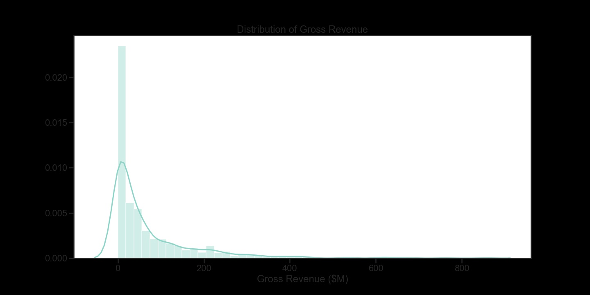
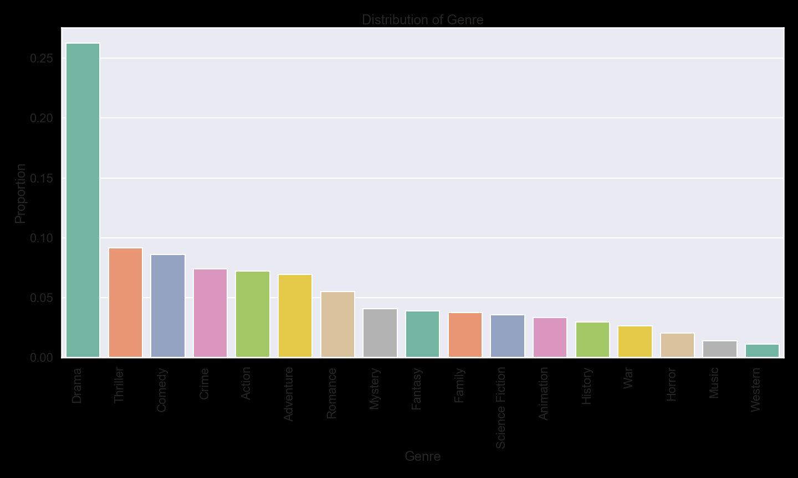
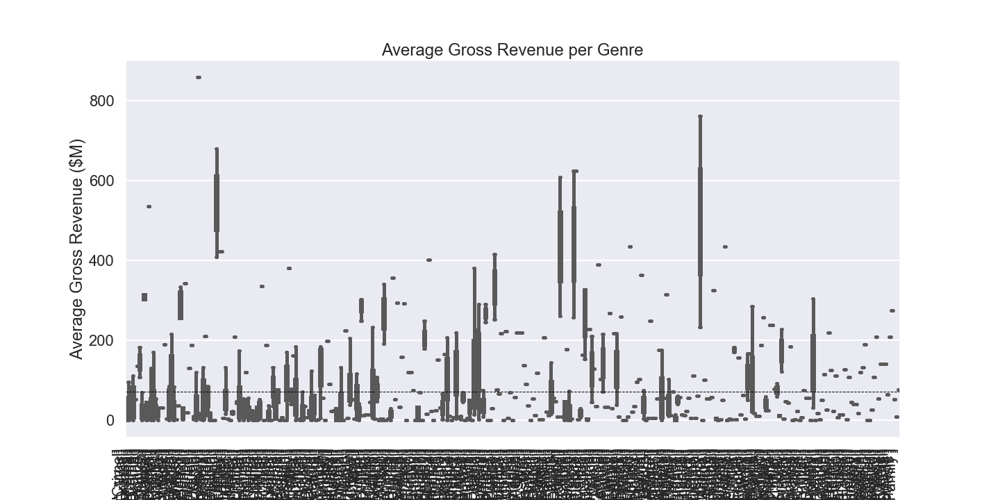
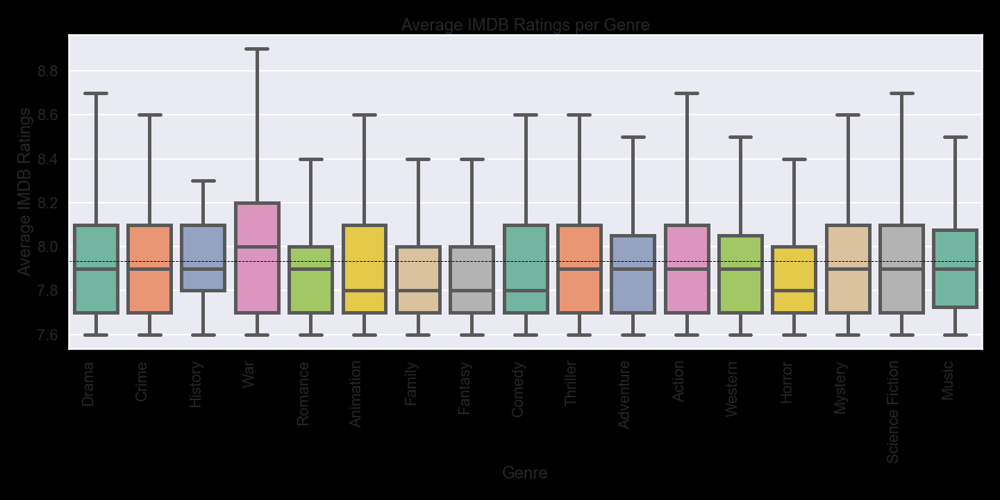
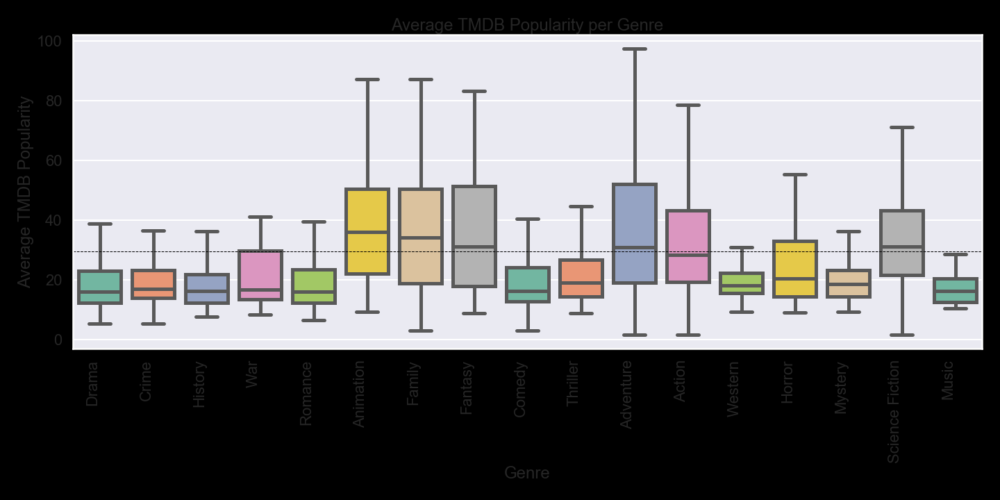

# Movie Analysis

## Project Overview

The Movie project involves gathering data from APIs and webscraping. After data was gathered exploratory data analysis was used to generate insights for a Microsoft. 

### Data

Movie datasets are collected from:

* IMDB website with Beautiful Soup
* https://www.themoviedb.org/ with API call

Worked with:
* Movie Genres
* Movie Gross
* Movie Release Date
* Movie Ratings

### Graphs

This graph demonstrates the skewed distribution. 

This graph demonstrates the popularity of each genre. Drama, thriller, and comedy are the three most popular genres based on our findings. 

Adventure, family, animation, and action generate the largest revenue. 

This boxplot demonstrates the IMDB Ratings of each genre. War movies have the highest average rating and the largest variation. 

From the graph one can see family, animation, fantasy, and adventure are more popular, on average. 

These graphs were made to show if there is any variation per month in gross per genre.

