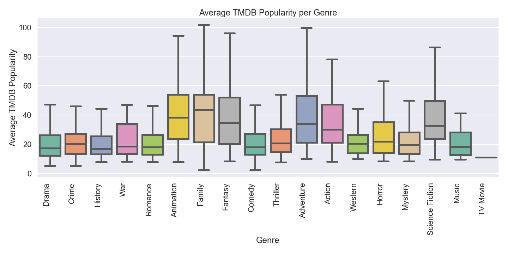

# Movie Analysis

## Project Overview

The MovieAnalysis project involves gathering data from APIs and webscraping. After the data was gathered, exploratory data analysis was used to generate insights for making recommendations for the new Microsoft Movies team. 

### Data

#### Movie datasets are collected from:
  * IMDB website with Beautiful Soup
  * https://www.themoviedb.org/ with API call

#### The visuals were provided by manipulating the following variables:
  * Genres
  * Gross Revenues
  * Release Month
  * IMDB Ratings
  * TMDB Popularity
  * Runtime

### Graphs

This graph demonstrates the skewed distribution. 

This graph demonstrates the popularity of each genre from the TMDB database. Drama, thriller, and comedy are the three most popular genres based on our findings. 

Adventure, family, animation, and action generate the largest revenue. 

This boxplot demonstrates the IMDB Ratings of each genre. There is no clear favorite for the genres, but war movies has the largest variation. 

From the graph one can see family, animation, fantasy, and adventure are more popular, on average. 

These graphs were made to show if there is any variation per month in gross per genre.

